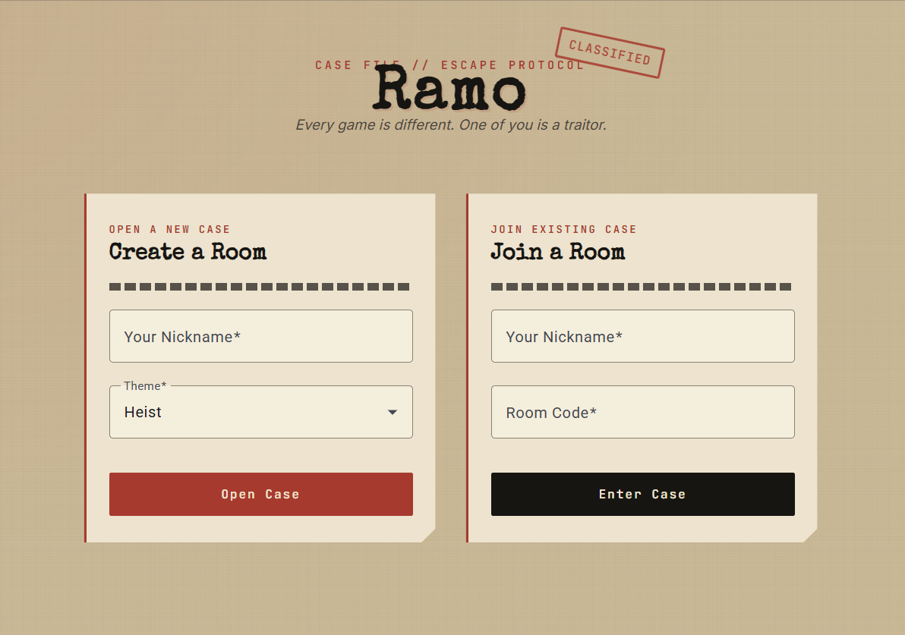
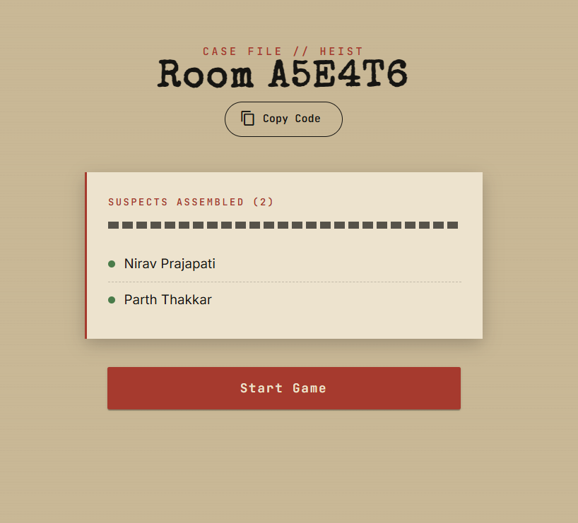
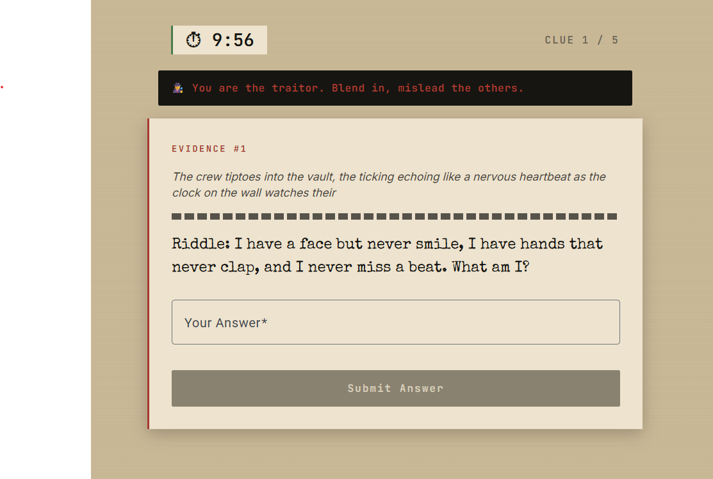
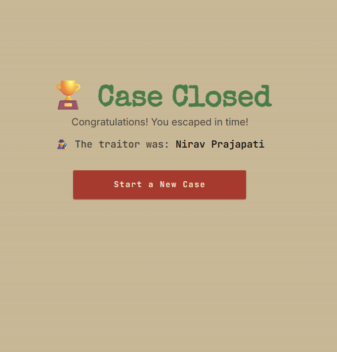

# Ramo 🔍

**AI-generated escape rooms. Every game is different. One of you is a traitor.**

**🔗 [Play Ramo Live](https://ramo-escape-room-e2cbf.web.app)**

Ramo is a real-time multiplayer escape room game where puzzles are generated fresh by AI for every playthrough — no two games are ever the same. Players work together against the clock to solve a sequence of AI-crafted puzzles (logic riddles, math, anagrams), while one randomly assigned player is secretly the traitor.

Built as a full-stack portfolio project to demonstrate real-time systems, AI integration, and production-style engineering decisions — not just CRUD.

---

## 🎮 How It Works

1. **Create or join a room** using a 6-character room code
2. **Wait for players** — play solo for a single-player puzzle experience, or with 2+ players to unlock the traitor twist
3. **Start the game** — with 2+ players, one is randomly and secretly assigned as the traitor
4. **Solve 5 AI-generated puzzles** as a team, racing against the clock
5. **Escape in time** to win, or run out of time and the case goes cold — either way, the traitor is revealed at the end

---

## 📸 Screenshots

<table>
  <tr>
    <td></td>
    <td></td>
  </tr>
  <tr>
    <td></td>
    <td></td>
  </tr>
</table>

---

## 🛠️ Tech Stack

**Frontend**

- Angular (standalone components, new `@if`/`@for` control flow)
- Angular Material
- Socket.io Client
- SCSS (custom "case file" design system)

**Backend**

- NestJS
- PostgreSQL + TypeORM
- Socket.io (real-time multiplayer sync)
- Groq API (`openai/gpt-oss-120b`) — AI puzzle generation

**Hosting**

- Frontend: Firebase Hosting
- Backend + Database: Render

---

## ✨ Key Engineering Decisions

A few things worth highlighting beyond "it works":

- **Server-authoritative, timestamp-based timer** — rather than broadcasting a "time left" value every second (which visibly glitches for players on higher-latency connections, e.g. across states or countries, due to out-of-order message delivery), the server sends a single fixed end-timestamp once. Each client then calculates its own remaining time locally every second, which stays smooth and perfectly in sync regardless of network jitter.
- **Solo mode** — the traitor mechanic only makes sense with 2+ players to hide among, so games can also be started and played solo as a pure puzzle-solving experience, with the traitor role simply skipped rather than forcing a minimum player count.
- **Traitor reveal** — at game end, the traitor's identity is revealed to give the mechanic a genuine payoff, instead of the role going unused for the entire game.
- **Iteratively tuned AI prompt from real playtesting** — the puzzle generation prompt went through multiple rounds of fixes based on actual bugs found by real players: enforcing exact-letter accuracy for anagrams (the model would occasionally scramble different letters than the answer required), requiring the model to self-verify math and pattern answers step-by-step before finalizing them, banning ambiguous riddle formats with multiple valid answers, and explicitly pushing for variety so the same puzzle concepts don't repeat across different games.
- **Duplicate-submission guard** — rapid double-clicking "Submit Answer" (e.g. on a slow connection) no longer risks skipping multiple puzzles in one go. The frontend disables the button while a submission is in flight, and the backend independently ignores re-submissions to a puzzle that's already been solved.
- **Answer normalization** — since the AI doesn't always format answers consistently (`"3:15"` vs `"315"`), submitted and stored answers are both normalized (lowercase, punctuation stripped) before comparison, so players aren't penalized for reasonable formatting differences.
- **Reconnect resilience** — if a player's browser tab is closed, backgrounded, or loses connection mid-game and reconnects later, the client proactively resyncs with the server's current state (current puzzle or final outcome) as soon as the page loads, instead of relying solely on a socket "reconnect" event that doesn't always fire reliably on mobile browsers.
- **Double-start protection** — starting a game twice for the same room (e.g. a double-click on "Start Game") no longer regenerates a duplicate puzzle set; it detects the existing puzzles and resends the current one instead.
- **Direct-link edge case** — opening a game/room URL in a fresh tab (e.g. a copied link) without going through the join flow no longer creates a "ghost" player with no identity. The app detects the missing session and redirects to Home with the room code pre-filled.

---

## 📂 Project Structure

```
ramo/
├── ramo-backend/     # NestJS API + Socket.io gateway
└── ramo-frontend/    # Angular client
```

---

## 🚀 Running Locally

### Backend

```bash
cd ramo-backend
npm install
# Create a .env file (see below)
npm run start:dev
```

**`.env` (backend)**

```env
DB_HOST=localhost
DB_PORT=5432
DB_USER=postgres
DB_PASSWORD=your_postgres_password
DB_NAME=ramo
GROQ_API_KEY=your_groq_api_key
FRONTEND_URL=http://localhost:4200
```

> Groq API keys are free — no credit card required. Get one at [console.groq.com](https://console.groq.com).

### Frontend

```bash
cd ramo-frontend
npm install
ng serve
```

Visit `http://localhost:4200`. The backend runs on `http://localhost:3000`.

---

## 🧠 Known Behavior & Limitations

Documented deliberately rather than left as silent gotchas:

- **Traitor identity is currently broadcast to all players** (not sent privately to just the traitor's socket) when there are 2+ players, since the backend doesn't yet maintain a reliable `playerId → socketId` mapping. Acceptable for demo purposes; flagged as a fix for a production version.
- **No minimum player enforcement mid-game** — if players leave after a game has started, the game continues for whoever remains. Only the initial "start game" action has any player-count logic (skipping the traitor assignment entirely below 2 players).
- **Puzzle difficulty and correctness are AI-judged**, not deterministically guaranteed — the generation prompt has been iteratively tuned based on real playtesting (age-appropriate difficulty, step-by-step answer verification, variety enforcement), but as an LLM-driven system, an occasional puzzle may still need a retry.
- **Free-tier hosting cold starts** — the backend (Render free tier) spins down after periods of inactivity, so the first request after a period of no traffic can take 30-50 seconds to wake up.

---

## 🗺️ Possible Future Directions

- Location-based / outdoor mode using real-world landmarks (Google Maps integration)
- Voice-based AI Game Master narration
- Additional themes beyond Heist (Horror, Comedy, Sci-fi)
- Private per-player traitor assignment via proper socket-to-player mapping
- Persistent player stats / leaderboard

---

## 👤 Author

Built by Nirav Prajapati — Full Stack Developer (Angular + NestJS), Melbourne, Australia.
